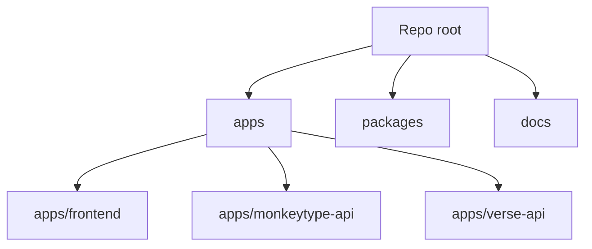

# ScriptureType Monorepo Refactor Plan (Structure + Docs Only)

## Goal
Move toward a clear monorepo layout with:
- `apps/frontend` (Monkeytype UI)
- `apps/verse-api` (Kotlin backend)
while removing the perceived backend/frontend duplication at the top level and inside the Monkeytype subtree. This plan intentionally **does not move files yet**; it defines structure, documentation, and docker/script updates first.

## Current Structure Snapshot
Top-level:
- `backend/` (Kotlin scripture API)
- `monkeytype/` (Monkeytype monorepo)
  - `frontend/` (Monkeytype UI app)
  - `backend/` (Monkeytype API)
  - `docker/`, `docs/`, `packages/`
- `prototype/`, `old-prototype/` (historical UI)

### Why It Feels Duplicated
There is:
- a **top-level** `backend/` (Scripture API), **and**
- a **nested** `monkeytype/backend/` (Monkeytype backend), **and**
- a **nested** `monkeytype/frontend/` (Monkeytype frontend UI)

This is correct for the current state but confusing without a clear top-level map. The refactor clarifies these responsibilities via `/apps` and `/packages` and updates docs + docker paths accordingly.

## Target Layout (No Moves Yet)
Proposed end-state structure:

```
apps/
  frontend/        (Monkeytype UI app)
  monkeytype-api/  (Monkeytype backend for accounts/stats)
  verse-api/       (Kotlin scripture API)
packages/
  (shared tooling, configs, or helpers)
docs/
  architecture/    (decisions, diagrams, runbooks)
prototype/         (optional: keep for reference)
old-prototype/     (optional: keep for reference)
```

### Mapping From Current Paths
- `monkeytype/frontend` -> `apps/frontend`
- `monkeytype/backend` -> `apps/monkeytype-api`
- `backend` -> `apps/verse-api`
- `monkeytype/packages` -> `packages`
- `monkeytype/docs` -> `docs` (or `docs/monkeytype` if you prefer)
- `monkeytype/docker` -> `apps/frontend/docker` (or `infra/docker`)

## Docker and Script Adjustments (Plan Only)
Key requirement: ensure `docker-compose` builds **this repo’s code** after the move.

### Docker compose (current location)
Current: [`monkeytype/docker/docker-compose.yml`](monkeytype/docker/docker-compose.yml)
Planned location: `apps/frontend/docker/docker-compose.yml` or `infra/docker/compose.yml`.

Planned edits (post-move):
- Update `build.context` to repo root (or an explicit path) so the Dockerfiles can reach `apps/frontend` and `apps/monkeytype-api`.
- Update `dockerfile` paths to new locations.
- Ensure `.env` references are moved and documented.

### Build docs
Current: [`monkeytype/docker/BUILD.md`](monkeytype/docker/BUILD.md)
Plan: move under `docs/` (e.g., `docs/docker-build.md`) and update commands to new paths.

## Documentation Updates (Now)
Add a **structure overview** and **run guide** that explains:
- top-level map with `apps/` targets
- which backend is which (verse API vs Monkeytype accounts/stats)
- how the Docker compose should be run from the repo

Suggested new docs:
- `docs/architecture/repo-structure.md`
- `docs/architecture/runbook.md`
- Update `README.md` and `SETUP_GUIDE.md` with the current structure + planned layout

## Migration Steps (Future, Code Mode)
1. Create `/apps` and `/packages` scaffolding.
2. Move folders to new targets with minimal code changes.
3. Update path references in:
   - Dockerfiles and docker-compose
   - package manager workspace files
   - scripts and docs
4. Validate Docker builds and local dev flows.
5. Remove legacy paths and update docs.

## Follow-up Tasks (Implementation Checklist)
- [ ] Create `apps/` and `packages/` directories
- [ ] Move `monkeytype/frontend` → `apps/frontend`
- [ ] Move `monkeytype/backend` → `apps/monkeytype-api`
- [ ] Move `backend` → `apps/verse-api`
- [ ] Move `monkeytype/packages` → `packages`
- [ ] Relocate docs into `docs/` (including Monkeytype docs)
- [ ] Update `pnpm-workspace.yaml` and related workspace configs
- [ ] Update Dockerfiles and compose paths to new locations
- [ ] Update scripts and documentation references to new paths
- [ ] Verify Docker build, frontend dev server, and verse API run

## Rollback Strategy
If any step fails:
- Restore previous folder layout from git.
- Revert docker-compose to use [`monkeytype/docker/docker-compose.yml`](monkeytype/docker/docker-compose.yml).

## Open Decisions
- Do we keep `prototype/` and `old-prototype/` in this repo long-term?
- Do we want `docs/monkeytype/` vs `docs/architecture/`?
- Should `apps/monkeytype-api` remain in the same repo, or be split later?

## Mermaid Overview


## Notes for Implementation
This plan is documentation-first and path-mapping only. No folder moves until you approve the final structure and updated docs.

## Test Flow Refactor Notes (2026-01-28)
- Extracted quick-restart messaging + incomplete test bookkeeping helpers to reduce duplication in [`monkeytype/frontend/src/ts/test/test-logic.ts`](monkeytype/frontend/src/ts/test/test-logic.ts:126).
- Centralized special character rendering (tab/newline) and live-indicator reset flow in [`monkeytype/frontend/src/ts/test/test-ui.ts`](monkeytype/frontend/src/ts/test/test-ui.ts:67) without behavior changes.
